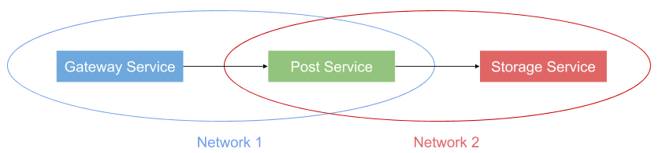

# Build project
- _docker/build.sh

# Run
- _docker/up.sh

# Kill
- _docker/down.sh

# Gateway
- http://localhost:8080/

# Article Service
- `[NOT AVAILABLE]` http://article-service:8080/
- `this is internal service, port is not mapped to host`

# Storage Service
- `[NOT AVAILABLE]` http://storage-service:8080/
- `this is internal service, port is not mapped to host`

# Diagrams
